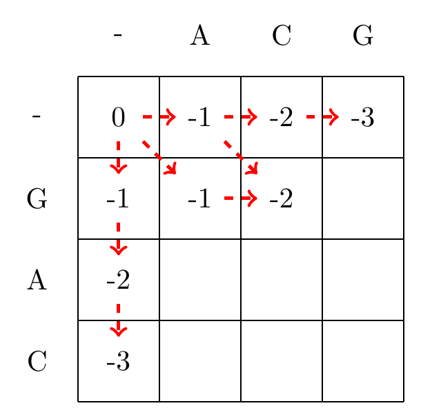
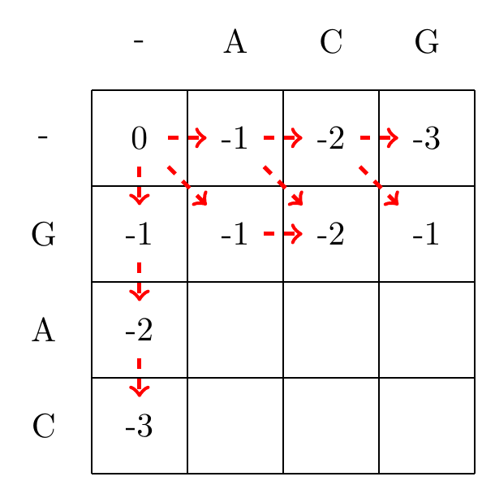
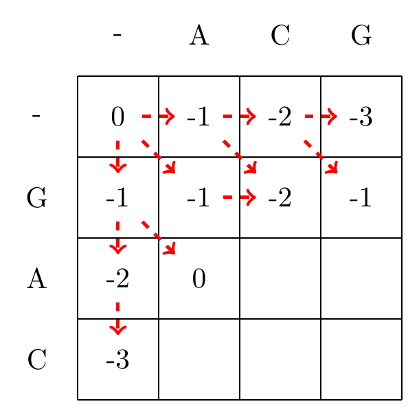
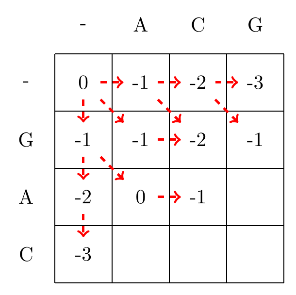
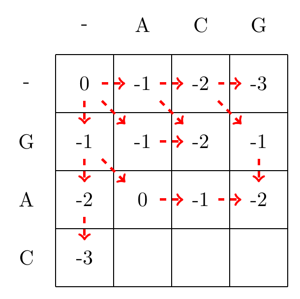
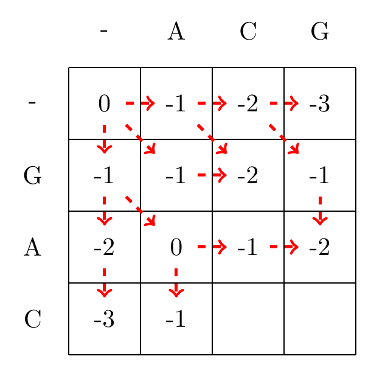
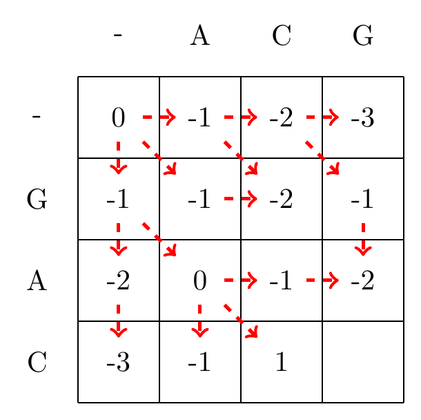
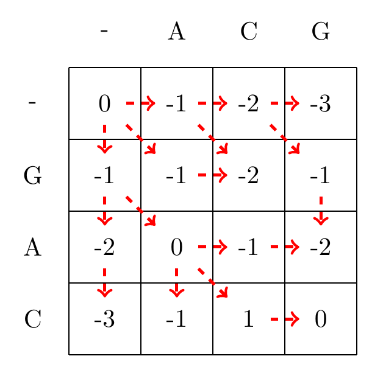

# Needleman-Wunsch Algorithm: Global Alignment

## Background

Developed by Saul B. Needleman and Christian D. Wunsch in 1970 {cite}`needleman1970general`, the Needleman-Wunsch algorithm was one of the first computational approaches to sequence alignment. Its introduction marked a significant advancement in bioinformatics, enabling the systematic and automated comparison of biological sequences.

## Principle

The algorithm is based on dynamic programming, a method that breaks down complex problems into simpler, smaller subproblems, solving each just once and storing their solutions. In the context of sequence alignment, it constructs an optimal global alignment by comparing every character of one sequence with every character of another, considering the costs of matches, mismatches, and gaps.

## The definitions of the problem, and the solution

Given two sequences $a_1,\ldots,a_N$ and $b_1,\ldots,b_M$, a scoring function $d(x,y)$, find a *global* alignment that gives an optimal (maximal) score.

The solution can be found by studying the dynamic programming matrix, $S$, of size $(N+1,M+1)$, by using the recursions defined in Equations {eq}`nw-init` and {eq}`nw-recursion`.

```{math}
:label: nw-init

S_{0,0} = 0, \\
S_{i,0} = d(x,-) \cdot i \ \textrm{for all}\ i, \\
S_{0,j} =  d(-,y) \cdot j\ \textrm{for all}\ j 
```

```{math}
:label: nw-recursion

S_{i,j}=\max
\begin{cases}
   S_{i-1,j-1} & + d(a_i,b_j)\\
   S_{i-1,j} & + d(a_i,-)\\
   S_{i,j-1} & + d(-,b_j).
\end{cases}
```

We will walk through these steps more carefully below.

## Process

1. **Initialization:** It starts by creating a scoring matrix where one sequence is aligned along the top and the other along the side. The first row and column are filled with gap penalties, increasing progressively to set up the basis for the algorithm according to Equation {eq}`nw-init`.

1. **Matrix Filling:** Each cell in the matrix is then filled based on the scores of adjacent cells (top, left, and diagonal), plus the score for matching or mismatching the corresponding characters, or introducing a gap. The choice of score at each cell reflects the highest score achievable from the possible alignments up to that point. Here we use the recursion given by Equation {eq}`nw-recursion`.

1. **Traceback:** Once the matrix is filled, the optimal alignment is determined by tracing back from the bottom-right corner to the top-left, following the path that resulted in the highest score. This path represents the optimal global alignment of the two sequences.

2. **Alignment Output:** The traceback path is used to construct the aligned sequences, introducing gaps as necessary, to maximize the alignment score based on the predefined scoring system. The final score of the alignment is given by the element, $S_{N,M}$.

## Applications and Importance

The Needleman-Wunsch algorithm is fundamental when the goal is to align entire sequences, providing a comprehensive view of their similarity. It's particularly valuable in evolutionary biology for comparing homologous sequences across different species, helping to infer phylogenetic relationships and evolutionary events. Moreover, it lays the foundation for understanding the principles of dynamic programming in bioinformatics, influencing the development of other alignment algorithms and tools.

Despite its computational intensity, especially for long sequences, the Needleman-Wunsch algorithm remains a crucial method for global sequence alignment, embodying the essence of comparing biological sequences in a mathematically rigorous and systematic way.

## Examples

### Example 1: Short sequences

Here is an example alignment of the sequences `GAC` and `ACG` using Needleman-Wunsch, when we have a scoring function,
$d(x,y)= \begin{cases}1 & \textrm{if} x=y\\ -1 & \textrm{otherwise } \end{cases}$.

We start by filling in the borders of the matrix using the Equation {eq}`nw-init`, as shown in {numref}`fig-nw-short-1`.

```{figure} ./img/nw_short_1.png
:name: fig-nw-short-1
:align: left
:width: 50%

Initialization of the gap penalty matrix for the Needleman-Wunsch algorithm, using using Equation {eq}`nw-init`.
```

We then recusively fill in the other elements of the matrix in a row wise manner using Equation {eq}`nw-recursion`, as shown in {numref}`fig-nw-recursion`.

:::{subfigure} ABC|DEF|GHI
    :subcaptions: below
    :align: left
    :name: fig-nw-recursion
    :class-grid: outline











Filling in the matrix. We fill in the elements recursively, in a row-wise manner. Each cell's value is evaluated using Equation {eq}`nw-recursion`. The values of each recursion is spelled out under each subfigure. We store trackers of which step we used to reach a certain cell, indicated by red arrows. Note that for some cells there are multiple optimal steps, i.e. paths that have the same score.
:::  

Given the filled in matrix, we can now track the optimal path from the bottom right element of the matrix, following the arrows back to the top-left element, as shown in {numref}`fig-nw-bt`.

```{figure} ./img/nw_short_bt.png
:name: fig-nw-bt
:align: left
:width: 50%

We follow the alignment backwards from the bottom-right corner to the top-left corner of the matrix, and mark the found optimal path with blue arrows.
```

### Example 2: Longer sequences

Here we align the sequences $a=$TGCATTA $b=$GCATTAC when $\displaystyle d(x,y)= \begin{cases}3 & \textrm{if} x=y\\-2 & \textrm{if} x= \textrm{- or } y=\textrm{-}\\  -1 & \textrm{otherwise } \end{cases}$. 

The resulting matrix is found in {numref}`fig-nw-long`.

```{figure} ./img/nw_long_bt.png
:name: fig-nw-long
:align: left
:width: 70%

We follow the alignment backwards from the bottom-right corner to the top-left corner of the matrix, and mark the found optimal path with blue arrows.
```

### Exercise

````{exercise} Needleman-Wunch Alignment 1
:label: ex-nwexe1

Calculate the Needleman Wunch Alignment of th following two sequences:

```
GATTA  
GCTAC
```

Use the following scoring scheme:
- Match: +3
- Mismatch: -1
- Gap penalty: -2

```{dropdown} **Reveal Answer**
```{figure} ./img/nw_exe1.png
---
scale: 50%
align: left
---
```
````

````{exercise} Needleman-Wunch Alignment 2
:label: ex-nwexe2

Calculate the Needleman Wunch Alignment of th following two sequences:

```
GCAGCTA   
GCTA
```

Use the following scoring scheme:
- Match: +3
- Mismatch: -1
- Gap penalty: -2

```{dropdown} **Reveal Answer**
```{figure} ./img/nw_exe2.png
---
scale: 50%
align: left
---
```
````

## Big-O Notation

Big-O notation is used in computational science for describing how the running time or memory usage of an algorithm scales with a given factor. E.g. if we expect the running time to scale as $g(x)$ we write that the algorithm has complexity $\mathcal{O}(g(x))$. A more formal definition can be found at [wikipedia](https://en.wikipedia.org/wiki/Big_O_notation).

In the case of Needelman-Wunch we see that the number of calculations needed are proportional to the size of the dynamic programming matrix, which equals the product of the lengths of the sequences, M x N. This results in a time complexity of $ \mathcal{O}(MN) $, indicating that the time to complete the task scales proportionally with the product of the lengths of the two sequences.

In the same way memory usage also scales with $ \mathcal{O}(MN)$, as the scoring matrix used to store intermediate results requires memory proportional to its size.

Big-O notation serves as a quick and effective tool for comparing different algorithms. For example, it allows us to see at a glance how the Needleman-Wunsch algorithm compares to other sequence alignment algorithms in terms of efficiency.

A useful comparison is the complexity of our initial proposition, to enumerate and calculate the scores for all possible alignments of two sequences. This can be done by calculating the number of alignments with $k$ matches/mis-matches between the two sequences which is ${M \choose k}{N \choose k}$. If we asume that $N>M$ and sum this for all possible values of $k$, we get $\sum_{k=0}^M{M \choose k}{N \choose k}=\sum_{k=0}^M{M \choose M-k}{N \choose k}={N+M \choose M}=\frac{(M+N)!}{M!*N!}$ number of different aligments. This can be shown to follow $ \mathcal{O}(2^{2N}/\sqrt{N})$ {cite}`lange2002mathematical, eddy2004dynamic`.

```{bibliography}
:filter: docname in docnames
```
