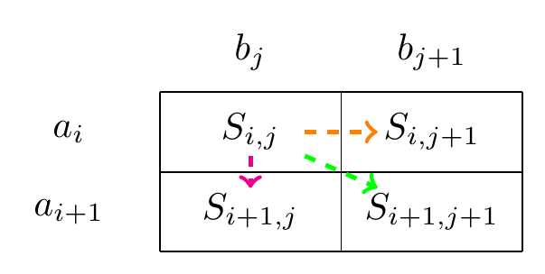

# Algorithms for pairwise alignments

Before delving into the intricacies of the alignment algorithms, it's crucial to understand the matrix representation of alignments. This approach is not just a computational convenience but a fundamental framework that encapsulates the complexity of aligning biological sequences. Here's an overview of why matrices are used in sequence alignment and the significance of the traceback process.

## Understanding Matrix Representation in Sequence Alignments

### The Essence of Matrices in Alignments

Aligning sequences involves comparing each character of one sequence with every character of another to identify regions of similarity or difference. Given the combinatorial explosion of possible alignments with even moderate-length sequences, a brute-force approach to comparison is computationally infeasible. This is where matrices come into play, offering a structured and efficient way to represent all possible alignments between two sequence.

### How Matrices Facilitate Alignment

A matrix for sequence alignment is essentially a grid. Each cell in this grid represents a comparison point between a character from one sequence and another from the second sequence. Each cell of the matrix correspond to the characters in the two sequences being aligned. And a path from the first left cell to the bottom right cell of the matrix represent a global alignment.

If your alignment is in position $a_i,b_j$ then the next step in the alignment is either a match/mismatch between $a_{i+1},b_{j+1}$ (diagonal movement), a delete $a_{i+1},-$, (a vertical movement), or an insert $-,b_{j+1}$, (a horizontal movement).

### Alignments as paths between the cells

The path we follow tells us how the sequences should be aligned. A move diagonally signifies a match or mismatch, indicating that the characters from both sequences should be aligned with each other. Moving up or to the left indicates a gap in one of the sequences.

In summary, the matrix representation of alignments and the traceback process are not merely computational techniques; they are integral to understanding the relationships between biological sequences. By breaking down the alignment process into a series of quantifiable steps, matrices allow us to systematically explore the vast space of alignment possibilities, leading us to the optimal alignment that best reflects the evolutionary or functional relationship between the sequences involved.

Pairwise sequence alignment is a fundamental technique in bioinformatics used to identify regions of similarity between two sequences, which may be indicative of functional, structural, or evolutionary relationships. Among the various methods available for pairwise alignment, the Needleman-Wunsch algorithm is pivotal, designed specifically for global alignment. Here's a brief overview of this influential algorithm:

## Needleman-Wunsch Algorithm: A Cornerstone of Global Alignment

### Background

Developed by Saul B. Needleman and Christian D. Wunsch in 1970, the Needleman-Wunsch algorithm was one of the first computational approaches to sequence alignment. Its introduction marked a significant advancement in bioinformatics, enabling the systematic and automated comparison of biological sequences.

### Principle

The algorithm is based on dynamic programming, a method that breaks down complex problems into simpler, smaller subproblems, solving each just once and storing their solutions. In the context of sequence alignment, it constructs an optimal global alignment by comparing every character of one sequence with every character of another, considering the costs of matches, mismatches, and gaps.

### Process

1. **Initialization:** It starts by creating a scoring matrix where one sequence is aligned along the top and the other along the side. The first row and column are filled with gap penalties, increasing progressively to set up the basis for the algorithm.

2. **Matrix Filling:** Each cell in the matrix is then filled based on the scores of adjacent cells (top, left, and diagonal), plus the score for matching or mismatching the corresponding characters, or introducing a gap. The choice of score at each cell reflects the highest score achievable from the possible alignments up to that point.

3. **Traceback:** Once the matrix is filled, the optimal alignment is determined by tracing back from the bottom-right corner to the top-left, following the path that resulted in the highest score. This path represents the optimal global alignment of the two sequences.

4. **Alignment Output:** The traceback path is used to construct the aligned sequences, introducing gaps as necessary, to maximize the alignment score based on the predefined scoring system.

### Applications and Importance

The Needleman-Wunsch algorithm is fundamental when the goal is to align entire sequences, providing a comprehensive view of their similarity. It's particularly valuable in evolutionary biology for comparing homologous sequences across different species, helping to infer phylogenetic relationships and evolutionary events. Moreover, it lays the foundation for understanding the principles of dynamic programming in bioinformatics, influencing the development of other alignment algorithms and tools.

Despite its computational intensity, especially for long sequences, the Needleman-Wunsch algorithm remains a crucial method for global sequence alignment, embodying the essence of comparing biological sequences in a mathematically rigorous and systematic way.